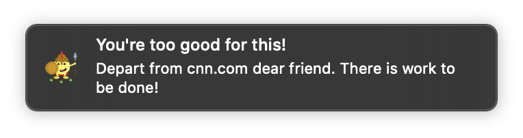
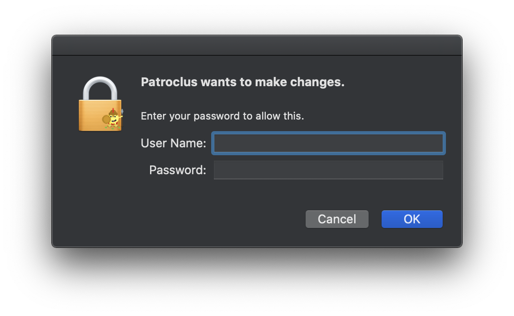
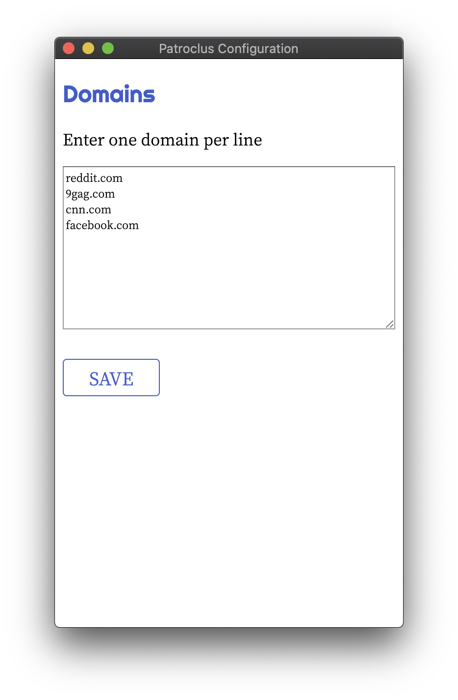

<p align="center">
	
	<br />
	
</p>

> Even though twenty such as you (probably referring to distracting things on the internet) had come in against me, they would all have been broken beneath my spear

## Why?

The internet can be a beautiful place. It can be a place where knowledge and information are exchanged openly and freely. It allows us to instantly communicate with fellow humans the world across. We can form communities without physical borders!

Sadly, there is always a meme site, a game, or a thrilling conversation taking place to distract you from the objective task at hand. Sometimes you want to work, but you are too weak to abstain from the allure of gifs and depressing news.

Patroclus watches your internet traffic and gives you a friendly nudge to stay on task. He never prevents, interferes, or tattles. He just sticks by your side to motivate you.

## What?

This is what you get:

<p align="center">
	
</p>


Thats right! Friendly notifications from a dear friend concerned about the time you waste on the internet!

## Usage

*Note: Patroclus has been built solely for macOS*

Per the note on permissions below, the first thing Patroclus will do is ask to open permissions up on the Berkley Packet Filter.

<p align="center">
	
</p>

Most of Patroclus' life will be spent in the tray on startup.

<p>
	
</p>

### Options

Patroclus is focused on one thing: giving you a pep talk when you visit a website you would rather not be visiting.

By clicking the tray menu option `Configure domains`, you will be greeted by the following screen:

<p align="center">
	
</p>

When `Save` is clicked, IP addresses for the given domains will be resolved and Patroclus
will begin keeping a watchful eye on visits to these addresses.

### Permissions

Permission is necessary to monitor network traffic. In order for Patroclus to keep a watchful eye
on your internet activities, he will need permission - much like a real friend!

When Patroclus starts up, he will ask for permission to make the following change:

```
$ sudo chmod o+r /dev/bpf*
```

This will allow reading of the [Berkley Packet Filter](https://en.wikipedia.org/wiki/Berkeley_Packet_Filter), and is just
what Patroclus needs.

### Gotchas

Patroclus is useless without notifications. If you have notifications disabled or "Do Not Disturb" turned on, then Patroclus' hands will be tied.

Patroclus will wait for a period of 10 min before notifying about a domain that he has already notified you about. Since he is informed by sniffing packets, you may be surprised when you are notified (maybe by a background process or another site embedding a tracking pixel from Facebook?).

If these problems become annoying for me, I will certainly fix them. Otherwise pull requests are welcome :)

## Building

Install Node dependencies:

    npm install

### Development

    clojure -A:dev
	
If you are using [CIDER](https://github.com/clojure-emacs/cider) for development, you should be able to leverage `cider-jack-in-clojurescript` as normal. The included `.dir-locals.el` should be configured to allow things to just work.

### Release

    clojure -A:main
    clojure -A:renderer
    npm run package

### Run tests from command line

    clojure -A:test


## Retrospective

Clojure(Script) continues to be a joy to work with.

I used [core.async](https://github.com/clojure/core.async) for message passing and it couldn't have been more delightful. Organizing packets as a stream of network events was a GOOD TIME.

[Electron](https://www.electronjs.org/) made things dumb easy in exchange for a rather large filesize. Trade-offs amirite?

I couldn't really find a gui notification library for Java/Clojure that seemed like what I was after. Most of the Java based packet sniffing libraries looked cumbersome to work with, and the nodejs lib [cap](https://www.npmjs.com/package/cap) was easy to use and bundle with the finished product (including native deps).

I built this for me, and I may use it for a while. If someone else finds it fun and useful then I will raise my glass to that!

This silly little app was made on top a bunch of very useful libraries made by people who are much smarter than me. Paul Butcher's [electron-app](https://github.com/paulbutcher/electron-app)clj template allowed me to just focus on writing Clojure. It is an excellent starting point for ClojureScript based electron apps.
